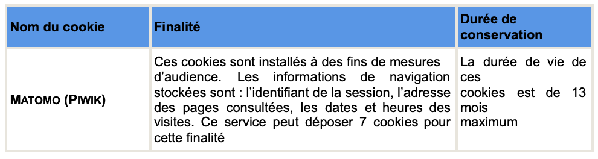

### Politique de confidentialité

Le Health Data Hub s’engage, dans le cadre de ses activités et conformément à la législation en vigueur en France et en Europe, à assurer la protection, la confidentialité et la sécurité des données à caractère personnel des Visiteurs de son site ainsi qu’à respecter leur vie privée.

#### Gestion des Données à caractère personnel

##### *Définition* 

La présente politique de confidentialité vous informe sur la façon dont la plateforme des données de santé ou « Health Data Hub »  traite vos données personnelles via le site du dictionnaire interactif. 
Ce site (https://health-data-hub.shinyapps.io/dico-snds/) a pour vocation d’assurer une présentation de l’ensemble des bases, tables, variables et nomenclatures du SNDS ainsi que le détail de chacun de ces éléments. Tout Visiteur connecté à ce site est réputé avoir pris connaissance des mentions légales et conditions d’utilisation ci-après.

Cette Politique  est susceptible d’évoluer en fonction du contexte légal et réglementaire ainsi que de la doctrine de la CNIL.
 
Les termes ci-dessous listés ont la définition suivante : 
 
- **Visiteur** : désigne toute personne visitant le site du dictionnaire interactif ; 
- **Site du dictionnaire interactif** : désigne le site internet ayant pour vocation d’assurer une présentation de l’ensemble des bases, tables, variables et nomenclatures du SNDS ainsi que le détail de chacun de ces éléments. Ce site est accessible à l’adresse suivante https://health-data-hub.shinyapps.io/dico-snds/ . 
- **Délégué à la protection des données** : désigne la personne en charge de conseiller et contrôler le Responsable de traitement en matière de protection des données personnelles ; 
- **Responsable de traitement** : est la personne morale incarnée par son représentant légal qui détermine les finalités et les moyens d’un traitement. Ici le Health Data Hub est responsable des traitements de données à caractère personnel mis en oeuvre sur le site du dictionnaire interactif ; 
- **Données à caractère personnel** : désignent toute information relative à une personne physique directement ou indirectement identifiable ; 
- **Commission Nationale de l’Informatique et des Libertés** (CNIL) : désigne l’autorité de contrôle en charge du respect des obligations en matière de données à caractère personnel en France. 
- **Règlement Général sur la Protection des Données** (RGPD) : texte réglementaire européen qui encadre le traitement des données à caractère personnel sur tout le territoire de l’Union européenne (n°2016/679 du 27 avril 2016). Il est entré en application le 25 mai 2018. 
 
#### Finalité et base légale des traitements de Données à caractère personnel
 
Le traitement de vos données à caractère personnel est soumis au respect du RGPD et à la loi n° 78-17 du 6 janvier 1978 relative à l’informatique, aux fichiers et aux libertés. 

Le Health Data Hub agit en tant que Responsable de traitement au sens du  RGPD.

Sur la base de votre consentement (article 6.1.a du RGPD), vous pouvez entrer en contact avec le Health Data Hub en cas de remarque, demande d’information ou d’interrogation, en envoyant un mail à l’adresse indiquée sur le site (opensource@health-data-hub.fr) et éventuellement transmettre vos noms, prénoms, adresse email et toute autre information à caractère personnel utile pour votre demande.

Le Health Data Hub veille à ne collecter et ne traiter que des données strictement nécessaires au regard de cette finalité mentionnée. Le Health Data Hub s’engage à respecter la confidentialité des messages qui lui sont transmis.

#### Destinataires des Données à caractère personnel

Vos informations personnelles sont uniquement traitées par les personnes habilitées du Health Data Hub et ne sont en aucun cas cédées à des tiers ou utilisées pour d’autres finalités. Votre adresse IP n’est connue que des seuls administrateurs du site internet et n’est  jamais rendue publique. 
Les données peuvent être transmises aux autorités compétentes, à leur demande, dans le cadre de procédures judiciaires, dans le cadre de recherches judiciaires et de sollicitations d’information à la demande des autorités ou afin de se conformer à d’autres obligations légales. 

#### Durée de conservation des Données à caractère personnel 

Vos données sont conservées jusqu’à la durée nécessaire à l’accomplissement du traitement de votre demande. En tout état de cause, vos données à caractère personnel ne sont pas conservées au-delà d’une période de cinq ans à compter de la date du dernier contact. A l’issue de cette période, vos données seront supprimées. 
 
#### Sécurité des Données à caractère personnel

Le Health Data Hub assure la sécurité et la confidentialité de vos données à caractère personnel en mettant en place une protection des données renforcée par l’utilisation de moyens de sécurisation physiques et logiques. Ces mesures techniques et organisationnelles visent à éviter la perte, la mauvaise utilisation, l’altération et la suppression des données à caractère personnel vous concernant. Ces mesures sont adaptées selon le niveau de sensibilité des données traitées et selon le niveau de risque que présente le traitement ou sa mise en œuvre. 

#### Vos droits
 
Conformément au RGPD et à la Loi Informatique et Libertés, vous disposez de droits au regard des données à caractère personnel que vous nous communiquez :
- le droit d’accès vous permet de savoir si des données vous concernant sont traitées et d’en obtenir la communication ;
- le droit de rectification vous permet de corriger des données inexactes vous concernant ou de compléter des données vous concernant ;
- le droit à l’effacement de vos données ;
- le droit à la portabilité des données, afin de récupérer les données vous concernant ;
- le droit à la limitation du traitement, afin de geler l’utilisation des données vous concernant dans certains cas.

Vous disposez également du droit de retirer votre consentement à tout moment.
 
Vous pouvez consulter le site de la CNIL afin de bénéficier de plus d’informations concernant vos droits relatifs aux données à caractère personnel : https://www.cnil.fr/fr/les-droits-pour-maitriser-vos-donnees-personnelles .

Afin d’obtenir des informations complémentaires sur le traitement de vos données ou exercer vos droits, vous pouvez contacter le Délégué à la protection des données du Health Data Hub à l’adresse suivante en justifiant de votre identité : dpd@health-data-hub.fr
Une réponse sera adressée dans un délai d’un mois à compter de la réception de la demande. 

Dans l’hypothèse où vous ne seriez pas satisfaits de nos échanges, vous pouvez adresser une réclamation auprès de la CNIL : https://www.cnil.fr/fr/plaintes .
 
#### Transfert de données à caractère personnel hors de l’Union Européenne
Aucune donnée collectée n’est susceptible d’être transférée hors de l’Union Européenne. 

#### Gestion des cookies et autres traceurs

##### *Définition*

Un "Cookie" est une suite d'informations, généralement de petite taille et identifié par un nom, qui peut être transmis à votre navigateur par un site web sur lequel vous vous connectez. Les cookies ont de multiples usages, ils peuvent notamment servir à mémoriser votre identifiant client auprès d'un site marchand, le contenu de votre panier d'achat, ou encore tracer votre navigation pour des finalités statistiques ou publicitaires.
 
Lors de sa visite sur le site du dictionnaire interactif, le Visiteur peut consentir ou refuser le dépôt de Cookies sur son équipement terminal.
Le Visiteur donne son consentement de façon indépendante et spécifique pour chaque finalité détaillée ci-dessous et a la possibilité de retirer son consentement à tout moment. Votre navigateur web le conservera pendant une certaine durée (voir le tableau ci-dessous), et le renverra au serveur web chaque fois que vous vous y connecterez. Ces réglages sont valables uniquement sur l’équipement et le navigateur que vous utilisez au moment où vous exprimez votre choix.
 
Vous pouvez également vous référer au bandeau d’information des Cookies qui apparaît, tant que vous n’avez pas exprimé votre choix, sur notre site internet.  
 
#### Finalité des Cookies 
 
Sur le site internet du dictionnaire interactif géré par le Health Data Hub, les Cookies susceptibles d’être installés permettent de réaliser des mesures d’audience. Aucun Cookie de performance analytique (qui permettent d’observer la façon dont les visiteurs naviguent sur le site internet et de déterminer le contenu qu’ils consultent et qui les intéresse), ni de Cookies tiers utilisés par les réseaux sociaux (Facebook, Google, Twitter, etc.) ne sont susceptibles d’être déposés sur votre terminal. 
 
Précisément, les Cookies utilisés sont les suivants :

 
Pour plus d’informations, vous pouvez consulter les Politiques de confidentialité / Cookies et autres traceurs de ces tiers. 
 
#### Suppression des Cookies
 
Vous pouvez paramétrer votre navigateur pour accepter ou refuser, au cas par cas, les Cookies préalablement à leur installation. 
Vous pouvez également régulièrement supprimer les Cookies de votre terminal via votre navigateur. 
 
Pour la gestion des Cookies et de vos choix, la configuration de chaque navigateur est différente. Elle est décrite dans le menu d’aide de votre navigateur, qui vous permettra de savoir de quelle manière modifier vos souhaits en matière de Cookies. 
A titre d’exemple :
1. Pour Internet Explorer : http://windows.microsoft.com/fr-FR/windows-vista/Block-or-allow-cookies ;
2. Pour Safari : http://docs.info.apple.com/article.html?path=Safari/3.0/fr/9277.html ;
3. Pour Chrome : http://support.google.com/chrome/bin/answer.py?hl=fr&hlrm=en&answer=95647
4. Pour Firefox :  http://support.mozilla.org/fr/kb/Activer%20et%20d%C3%A9sactiver%20les%20cookies ;
 
Ces réglages sont valables uniquement sur l’équipement et le navigateur que vous utilisez au moment où vous exprimez votre choix.
 
#### Mise à jour

La présente Politique de confidentialité peut être amenée à évoluer selon le contexte légal et réglementaire ainsi que de la doctrine de la CNIL. Le Health Data Hub invite le Visiteur à consulter régulièrement la présente page pour prendre connaissance des changements et des nouvelles informations.

<html>
</html>

### Mentions légales

#### Objet
Le site du dictionnaire interactif (https://health-data-hub.shinyapps.io/dico-snds/)  a pour vocation d’assurer une présentation de l’ensemble des bases tables, variables et nomenclatures du Système national des données de santé (SNDS) ainsi que le détail de chacun de ces éléments. Tout internaute connecté à ce site est réputé avoir pris connaissance des mentions légales et conditions d’utilisation ci-après.

#### Éditeur
Ce site est sous la responsabilité du groupement d’intérêt public Plateforme des données de santé ou « Health Data Hub », dont le siège est situé 9 rue Georges Pitard, 75015 Paris, E-mail : hdh@health-data-hub.fr

Le représentant légal du Health Data Hub et directeur de la publication du site est Mme Stéphanie Combes en sa qualité de Directrice du Health Data Hub.

#### Hébergeur
Ce site est hébergé sur les serveurs de l'hébergeur shinyapps.io, localisés aux États-Unis.
Site web : https://www.shinyapps.io.

#### Développement et conception graphique
Le suivi éditorial, graphique et technique du site est assuré au quotidien par les personnels du Health Data Hub et en particulier les personnes en charge de la communication et de l’animation de l’écosystème.

#### Réutilisation des informations publiques
Les conditions de libre réutilisation fixées ci-après s’appliquent uniquement aux contenus, données et publications diffusées sur le site health-data-hub.fr et constituent des informations publiques au sens de la loi n°78-753 du 17 juillet 1978.

Les marques et logos disponibles sur ce site ne sont pas librement réutilisables : pour toute demande de réutilisation des marques et logos, veuillez nous contacter à l’adresse suivante : hdh@health-data-hub.fr 

Les informations tierces accessibles depuis ce site, notamment les actualités de l’écosystème peuvent être soumises à des conditions de réutilisation particulières.

Les publications disponibles sur ce site sont des œuvres originales dont le Health Data Hub concède des droits de reproduction et de diffusion dans les conditions ci-après. Le Health Data Hub et les auteurs conservent, respectivement, leurs droits patrimoniaux et moraux sur ces œuvres.
 
L’utilisateur du site est autorisé :
- à reproduire et à rediffuser les informations contenues sur ce site, sous réserve :
  * de la mention exacte de la source [Auteur, Titre, Éditeur, date de mise à jour, adresse internet] ;
  * d’informer le Health Data Hub de ces reproductions en contactant hdh@health-data-hub.fr ;
- à retraiter, à inclure ou à exploiter ces informations, sous réserve de ne pas en dénaturer le sens ni l’exactitude et de ne pas induire en erreur des tiers quant au contenu ou à la source de ces informations ;
- pour le monde entier et sans limitation de durée ;
- à des fins commerciales ou non.
 
Pour toute demande de dérogation à ces conditions, veuillez contacter hdh@health-data-hub.fr.

#### Liens vers ce site
Le Health Data Hub est favorable à la création de liens hypertextes vers les pages de son site internet. De façon générale, tout lien établi doit indiquer de façon claire à l’internaute qu’il est dirigé vers le site https://health-data-hub.shinyapps.io/dico-snds/, en faisant notamment mention intégrale et visible de cette adresse.

Le Health Data Hub se réserve le droit de demander la dissolution des liens dont elle estimera qu’ils sont de nature à porter préjudice à son image ou à ses droits.

#### Limitation de responsabilité
#### Disponibilité du service
Le site https://health-data-hub.shinyapps.io/dico-snds/ est accessible librement et gratuitement en tout lieu à tout visiteur ayant un accès à internet. Tous les frais pour y accéder (matériel informatique, logiciels, connexion internet, etc.) sont à la charge du visiteur. 
Le Health Data Hub s’efforce d’ouvrir l’accès à ce site 24 heures sur 24, 7 jours sur 7, sauf en cas de force majeure et sous réserve d’éventuelles pannes, modifications et d’interventions de maintenance. Le Health Data Hub peut être amené à interrompre ce site ou une partie des services à tout moment, sans préavis ni indemnités.

Le Health Data Hub met en œuvre tous les moyens mis à sa disposition pour assurer un accès et une utilisation de qualité au site et à ses services. L’obligation étant de moyens, la responsabilité du Health Data Hub ne sera pas engagée si ce résultat n’est pas atteint. Le visiteur a la possibilité de contacter le site par messagerie électronique à l’adresse suivante : hdh@health-data-hub.fr 

#### Informations contenues sur ce site
Les informations figurant sur ce site proviennent de sources considérées comme étant fiables.

Toutefois, elles sont susceptibles de contenir des erreurs que le Health Data Hub se réserve le droit de corriger dès qu’elles sont portées à sa connaissance. Les informations disponibles sur ce site sont susceptibles d’être modifiées à tout moment, et peuvent avoir fait l’objet de mises à jour depuis leur dernière consultation.

Les sites internet ou informations tierces référencées sur ce site par des liens ont été sélectionnés et mis à disposition des utilisateurs à titre d’information. Malgré le soin apporté à leur sélection, ceux-ci peuvent contenir des informations inexactes ou sujettes à interprétation.

Le Health Data Hub ne pourra en aucun cas être tenu responsable de tout dommage de quelque nature qu’il soit résultant de l’interprétation ou de l’utilisation des informations disponibles sur ce site ou sur les sites tiers.
